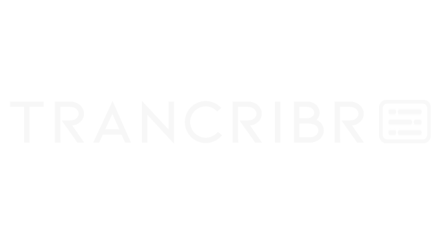

    

 A web app for transcribing Media. Uses OpenAI's Whisper.

# Usage
Select Transcribing options then drag and drog all the files to transcribe or translate. A live deploy is in the hugging face space below but it doens't have GPUs. It will be real slow to run whisper there.

# Deploy locally
Python 3.10.8 was used
1. `pip install -r requirements.txt`
2. `streamlit run main.py`

# Credits

* OpenAI Whisper https://github.com/openai/whisper
